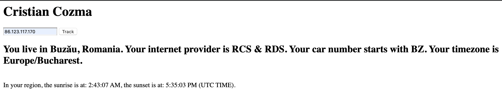

# Proiect Cloud Computing

## Arhitectura aplicatiei
Aplicatia este dezvoltata in limbajele: JavaScript si HTML

**HTML** este o forma de marcare orientata catre prezentarea documentelor text pe o singura pagină, utilizând un software de redare specializat, numit agent utilizator HTML, cel mai bun exemplu de astfel de software fiind browserul web. In proiectul meu pentru partea de body am folosit un element de tip input pentru a introduce IP-ul despre care se doresc informatii, un buton pentru a initia cautarea, un header si un label care isi vor schimba innerHTML-ul pentru a furniza informatiile dorite.

**JavaScript (JS)** este un limbaj de programare orientat obiect bazat pe conceptul prototipurilor. Este folosit mai ales pentru introducerea unor functionalittii in paginile web, codul JavaScript din aceste pagini fiind rulat de catre browser. Limbajul este binecunoscut pentru folosirea sa în construirea siturilor web, dar este folosit și pentru accesul la obiecte incastrate (embedded objects) in alte aplicatii.

Termenul de **API** este acronimul de la Application Programing Interface care in limba romana se poate traduce ca interfata de programare a aplicatiilor si reprezinta un set de reguli si specificatii cu ajutorul carora un program poate accesa si folosi resursele oferite de un alt program. Cu alte cuvinte, un program care ofera API-uri permite altor programe sa interactioneze cu acesta automat, de la program la program sau de la program la sistem de operare, fara sa fie nevoie de folosirea unei interfete grafice de utilizare (GUI) si fara cunostinte legate de arhitectura sau elemente de programare ale programului ci doar folosirea specificatiilor de utilizare a API-ului oferit.

## Descriere problema: 
Aplcatia furnizeaza informatii despre adresa IP introdusa in frontend intr-un mod foarte rapid folosind *ip-api.com*. M-am gandit sa imbin aceste informatii cu ce imi ofera *api.sunrise-sunset.org* pentru a afla chiar mai multe informatii despre locul IP-ului respectiv. 

## Descriere API:
Pentru datele despre IP am ales sa folosesc API-ul de la *IP-API* ( **ip-api.com** ) deoarece acesta ofera o colectie mare de detalii despre adresele IP - cum ar fi *oras, tara, provider-ul serviciilor de internet, regiune, timezone*, primind ca parametru adresa IP.
Formatul pe care il primesc de la **API** va fi **JavaScript Object Notation (JSON)**. Cel de-al doilea API este *SUNRISE SUNSET* ( **api.sunrise-sunset.org**) la care request-ul catre **API** se face primind ca parametri latitudinea si longitudinea.

## Flux de date:
* Se foloseste XMLHttpRequest pentru a face un request catre *backend*
* Daca am primit response code-ul 200 (succes) si readyState-ul este 4 (done) parsam raspunsul primit ca JSON pentru a folosi datele pe frontend.
* Se face un request in backend catre API, iar serverul va trimite clientului JSON-ul rezultat.

## Capturi ecran:
